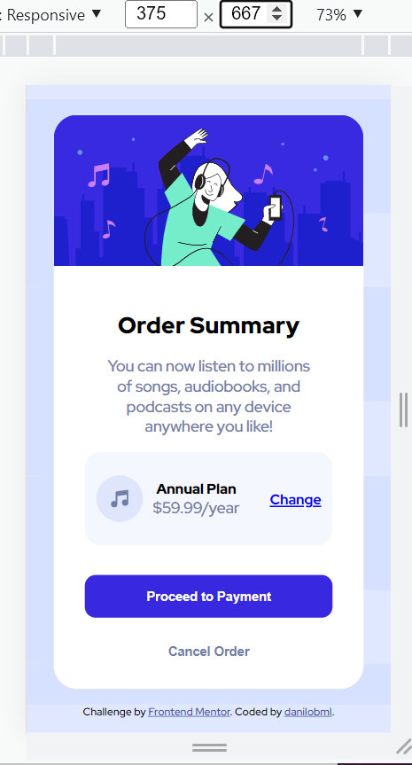
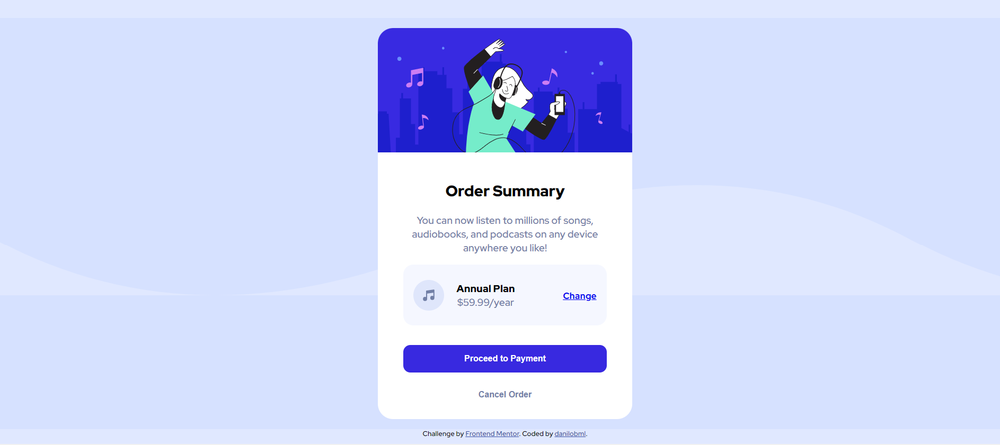

# Frontend Mentor - Order summary card solution

This is a solution to the [Order summary card challenge on Frontend Mentor](https://www.frontendmentor.io/challenges/order-summary-component-QlPmajDUj). Frontend Mentor challenges help you improve your coding skills by building realistic projects. 

## Table of contents

- [Overview](#overview)
  - [The challenge](#the-challenge)
  - [Screenshot](#screenshot)
  - [Links](#links)
- [My process](#my-process)
  - [Built with](#built-with)
  - [What I learned](#what-i-learned)
  - [Continued development](#continued-development)
  - [Useful resources](#useful-resources)
- [Author](#author)
- [Acknowledgments](#acknowledgments)

## Overview

Hi, thanks for your unvaluable help! I'm a total newbie, having started coding for no more than a month at this point. So, I'd immensely appreciate if you could come take a look and give me some tips and show me ways to do things better.
 
I know this challenge was supposed to be simple, but I honestly had quite some difficulty with CSS flexbox positioning, especially in the "small box" (Music Icon, "Annual plan" and link). I tried to use "justify-content: flex-start;" for those items, then changing the link to the right with "justify-self: flex-end;". Nothing happened. I then tried "justify-content: space-around;", then moving the "Annual Plan" part. It also didn't work. 

My solution in the end was using margins for each item, in different amounts for mobile and desktop. But I have the impression that this is not very responsive and, while it seems ok for 375px and full desktop, for screen sizes in between it looks a bit awkward. Could anyone please help me learning a better way to do it? I'd very much appreciate that and I'd love to learn this for real. 

### The challenge

Users should be able to:

- See hover states for interactive elements

### Screenshot

### Links

- Solution URL: (https://github.com/danilobml/order-summary)
- Live Site URL: (https://danilobml.github.io/order-summary/)

## My process

### Built with

- Semantic HTML5 markup
- CSS custom properties
- Flexbox
- Mobile-first workflow

### What I learned

I've learned how to do the hover effects, and using svg images as background. I also learned that I still find positioning very tough.

### Continued development

I'd really like to learn how to position items in a flex-container better and to design in a properly responsive way.

### Useful resources

- [W3Schools](https://www.example.com) - This helped me with hover effects and using the SVG.

## Author

- Website - [danilobml](https://www.your-site.com)

## Acknowledgments

I want to thank Ben at WBS Coding School once more for being a great teacher! But all the mistakes here are fully mine (he hasn't seen this).